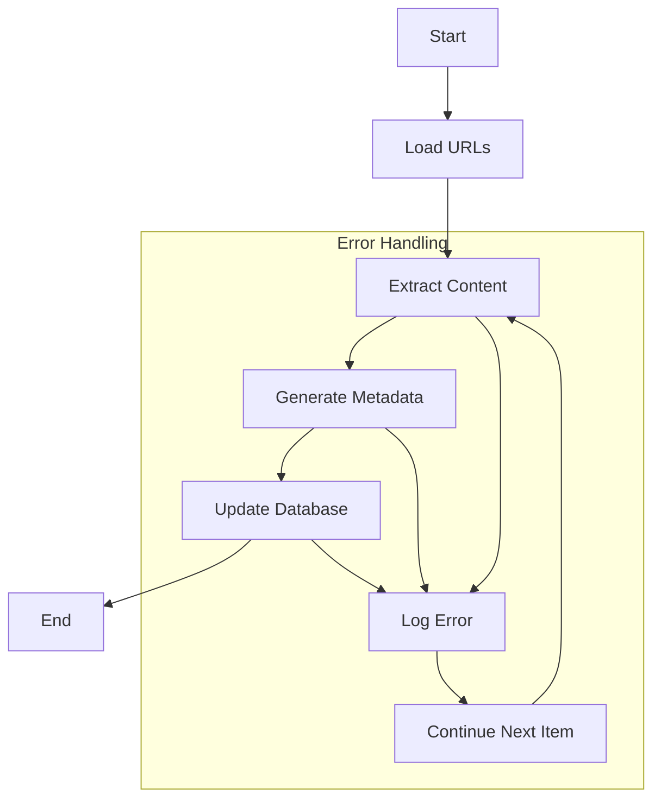

# SEO Metadata Generator 🚀

[](https://www.python.org/downloads/)
[](https://opensource.org/licenses/MIT)
[](https://wordpress.org/)
[](https://rankmath.com/)

An AI-powered tool that automatically generates and updates SEO metadata for WordPress content using the Rank Math SEO plugin. Supports multiple AI providers including Google Gemini, OpenAI, DeepSeek, and Anthropic Claude.

## 📋 Table of Contents

- [Features](#-features)
- [Prerequisites](#-prerequisites)
- [Installation](#-installation)
- [Configuration](#-configuration)
- [Usage](#-usage)
- [Workflow](#-workflow)
- [Post Types](#-post-types)
- [AI Providers](#-ai-providers)
- [WordPress Integration](#-wordpress-integration)
- [Troubleshooting](#-troubleshooting)
- [Contributing](#-contributing)
- [License](#-license)

## ✨ Features

- 🔄 **Multi-Phase Processing**
  - URL extraction and validation
  - Content analysis and metadata generation
  - Database updates with batch processing
- 🤖 **AI Integration**
  - Multiple provider support (Google, OpenAI, DeepSeek, Claude)
  - Context-aware prompts for different post types
  - Cost-effective model selection
- 🔧 **WordPress Integration**
  - REST API communication
  - Rank Math SEO plugin compatibility
  - Support for custom post types
  - Custom REST API endpoints for SEO metadata
- 🛠️ **Development Tools**
  - Dry-run mode for testing
  - Configurable logging
  - Error handling and recovery

## 📋 Prerequisites

- Python 3.8 or higher
- WordPress site with Rank Math SEO plugin
- API keys for at least one AI provider
- WordPress application password

## 🚀 Installation

### 1. Clone the Repository

```bash
git clone https://github.com/ahvega/seo-meta-gen.git
cd seo-meta-gen
```

### 2. Install Dependencies

```bash
pip install -r requirements.txt
```

### 3. Configure Environment

```bash
cp .env.example .env
```

Edit `.env` with your credentials:

```env
# AI Provider Configuration
PREFERRED_AI_PROVIDER=google  # Options: google, openai, deepseek, anthropic
GOOGLE_API_KEY=your_key
OPENAI_API_KEY=your_key
DEEPSEEK_API_KEY=your_key
ANTHROPIC_API_KEY=your_key

# WordPress Configuration
WORDPRESS_URL=https://your-site.com
WORDPRESS_USERNAME=your_username
WORDPRESS_PASSWORD=your_password
```

## 🔧 Configuration

### AI Provider Models

| Provider | Default Model | Cost/M Tokens | Context Window |
|----------|--------------|---------------|----------------|
| Google   | gemini-1.5-flash-8b | $0.1875 | 128K |
| OpenAI   | gpt-4.1-nano | $0.50 | 1M/32K |
| DeepSeek | R1 | $2.74 | - |
| Claude   | claude-3-5-haiku | $4.80 | 200K/8K |

### Post Type Configuration

```python
POST_TYPE_CONTEXT = {
    'post': {
        'context': 'blog post',
        'metadata_priority': ['title', 'description', 'keywords', 'content']
    },
    'page': {
        'context': 'website page',
        'metadata_priority': ['title', 'description', 'keywords']
    },
    # ... other post types
}
```

## 💻 Usage

### Phase 1: URL Processing

```bash
python -m seo_meta_gen.main --source my_site_urls.json --post-type page
```

### Phase 2: Metadata Generation

```bash
python -m seo_meta_gen.main --source my_site_urls.json --post-type page --generate-metadata
```

### Phase 3: Database Update

```bash
python -m seo_meta_gen.main --source output/generated_metadata_page.json --write-to-db
```

### Test Mode

```bash
python test_dry_run.py --provider google --type page --url "https://your-site.com/page" --dry-run
```

## 🔄 Workflow



## 📝 Post Types

| Type | Context | Priority Metadata |
|------|---------|-------------------|
| Post | Blog content | Title, Description, Keywords |
| Page | Website page | Title, Description, Keywords |
| Service | Service offering | Title, Description, Features |
| Staff | Team member | Name, Role, Expertise |
| Testimonial | Client feedback | Client, Service, Rating |
| Category | Service grouping | Title, Description, Services |

## 🤖 AI Providers

### 1. Google Gemini (Recommended)

- Most cost-effective
- Good for creative content
- Free tier available

### 2. OpenAI

- Balanced quality/cost
- Free tokens program
- Good for technical content

### 3. DeepSeek

- Reliable performance
- Good for general SEO
- Competitive pricing

### 4. Anthropic Claude

- Best quality
- Complex content handling
- Higher cost

## 🔧 WordPress Integration

### REST API Setup

To enable the SEO Metadata Generator to communicate with your WordPress site, you need to:

1. Install and activate the Rank Math SEO plugin
2. Add the `functions.php` file to your WordPress theme or create a custom plugin
3. Configure WordPress application passwords for API authentication

### functions.php

The `functions.php` file is a crucial component that enables the tool to interact with Rank Math SEO metadata through the WordPress REST API. It:

- Exposes Rank Math SEO fields for all public post types
- Provides read/write access to SEO metadata
- Supports both posts and taxonomies
- Includes proper sanitization and validation

To install:

1. Copy `functions.php` to your WordPress theme directory
2. Or create a custom plugin and include the file
3. Ensure the file is loaded by WordPress

The file exposes the following SEO fields:

- Title
- Description
- Focus Keyword
- Canonical URL
- Open Graph Title/Description
- Twitter Card Title/Description

## 🐛 Troubleshooting

### Common Issues

1. **Invalid Post IDs**
   - Ensure correct post type mapping
   - Check URL structure
   - Verify WordPress API access

2. **API Rate Limits**
   - Use appropriate model
   - Implement rate limiting
   - Monitor usage

3. **Content Extraction**
   - Verify URL accessibility
   - Check WordPress settings
   - Validate content structure

### Logging Levels

- `INFO`: Basic progress
- `DEBUG`: Detailed information
- `ERROR`: Critical issues

## 🤝 Contributing

1. Fork the repository
2. Create your feature branch
3. Commit your changes
4. Push to the branch
5. Create a Pull Request

## 📄 License

This project is licensed under the MIT License - see the [LICENSE](LICENSE) file for details.
